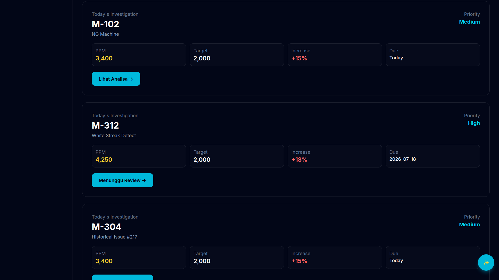
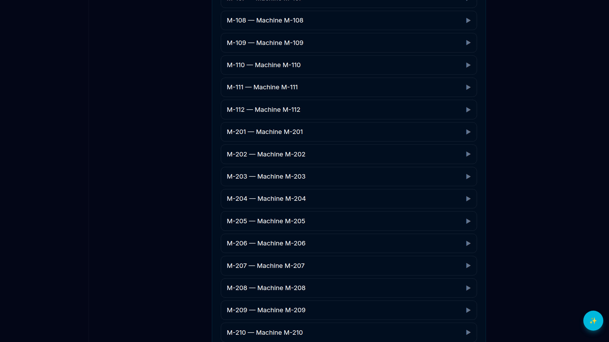
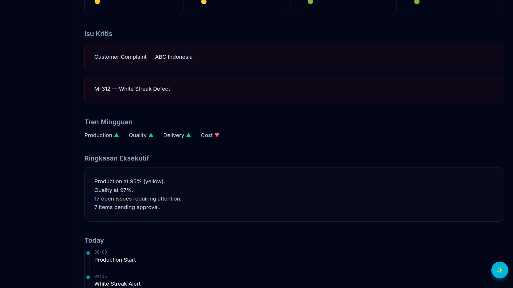
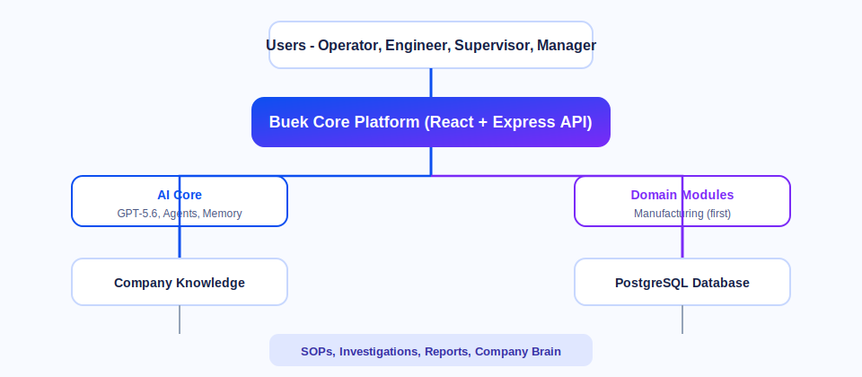

<p align="center">
  
</p>

<p align="center">
  <a href="https://core.buekwebsite.com"><strong>🌐 Live Demo</strong></a>
  &nbsp;·&nbsp;
  <a href="https://github.com/abdularief23/buek-core"><strong>GitHub</strong></a>
  &nbsp;·&nbsp;
  <a href="docs/voiceover-script.md"><strong>Demo Video Script</strong></a>
</p>

---

## The problem

Manufacturing teams lose **hours every day** investigating production issues.

Before an engineer can even start solving a problem, they search through SOPs, historical reports, and scattered company knowledge — while the production line waits.

## Our approach

Most AI applications are built for a single industry.

**Buek Core** takes a different approach: we built **one reusable AI platform** where industry knowledge is added as independent modules. **Manufacturing is our first domain** — healthcare, construction, and retail come next.

Buek Core turns that fragmented workflow into one AI-powered platform where **Operators, Engineers, Supervisors, and Plant Managers** work together — with GPT-5.6 as the reasoning layer and a shared **Company Brain** that gets smarter over time.

**Try it now (no install):** [core.buekwebsite.com](https://core.buekwebsite.com)

---

## What we built

| Problem | Buek Core solution |
|---------|-------------------|
| Production issues are hard to investigate | AI-guided **5-step investigation wizard** |
| Knowledge is scattered across SOPs and reports | **Company Brain** — searchable organizational memory |
| Different roles use different tools | **Unified role-based workspaces** for every user |
| Engineering reports take hours | **GPT-5.6-assisted** report drafting and analysis |
| Each industry needs its own AI rebuild | **Pluggable domain modules** on one AI Core |

<p align="center">
  
  <br /><em>Engineer workspace — investigations, KPIs, and AI copilot</em>
</p>

---

## Quick demo

```
Epson Indonesia → Engineer → Launch Demo → White Streak → 5-step wizard → Supervisor → Approve → PDF report
```

1. Open **[core.buekwebsite.com](https://core.buekwebsite.com)**
2. Pick **Epson Indonesia** → **Engineer** → **Launch Demo**
3. Open **White Streak on Print** → walk the wizard
4. Switch to **Supervisor** → approve → download the engineering report

No install needed. AI Copilot is live on the demo server.

<p align="center">
  
  <br /><em>Investigation wizard — evidence through execution plan</em>
</p>

---

## How GPT-5.6 powers the workflow

<p align="center">
  
</p>

GPT-5.6 runs inside the live app via the OpenAI Responses API:

| Step | What GPT-5.6 does |
|------|-------------------|
| **Analyze** | Ranks possible root causes from evidence — engineer always decides |
| **Retrieve** | Pulls relevant SOPs, work instructions, and similar past cases |
| **Draft** | Helps write investigation reports and countermeasure plans |
| **Assist** | AI Copilot answers in plain language — summarize, search, draft |

**Try it:** launch demo → click ✨ copilot → *"What are the possible causes for white streak?"*

<p align="center">
  
  <br /><em>Company Brain — every closed investigation makes the factory smarter</em>
</p>

<p align="center">
  
  <br /><em>Plant Manager — executive KPIs and critical issues at a glance</em>
</p>

---

## How we built it with Codex

<a id="how-we-used-codex-and-gpt-56"></a>

**Codex accelerated development** by generating scaffolding, refactoring code, implementing features, fixing bugs, and assisting deployment throughout the project.

| Area | What Codex helped build |
|------|-------------------------|
| **Full-stack app** | React 19 UI, Express API, Prisma schema, PostgreSQL seed data |
| **Role-based UX** | Operator / Engineer / Supervisor / Manager homes, mobile field layout |
| **Investigation flow** | 5-step wizard, approval workflow, PDF/DOCX report export |
| **AI integration** | OpenAI Responses API, SSE streaming, guardrails, knowledge retrieval |
| **Infrastructure** | Docker Compose, Nginx deploy, GitHub Actions, VPS recovery scripts |
| **Demo assets** | Video scene renderers, voiceover script, README screenshots |

> **Codex Session ID:** run `/feedback` inside Codex on this repo → paste into Devpost form.

---

## Architecture

<p align="center">
  
</p>

```text
Users (Operator · Engineer · Supervisor · Manager)
        ↓
Buek Core Platform (React + Express API)
        ↓
   ┌────┴────┐
AI Core     Domain Modules
(GPT-5.6)   (Manufacturing → future verticals)
   └────┬────┘
Company Knowledge + PostgreSQL
```

One AI Core. Unlimited industries. Details: [docs/architecture.md](docs/architecture.md)

---

## For judges

| Resource | Link |
|----------|------|
| **Live demo** | [core.buekwebsite.com](https://core.buekwebsite.com) |
| **Demo video script** | [docs/voiceover-script.md](docs/voiceover-script.md) |
| **Voiceover audio** | `tools/video-gen/voiceover/voiceover-full.mp3` |
| **Repo access** (if private) | `testing@devpost.com` · `build-week-event@openai.com` |

---

## Tech stack

React 19 · TypeScript · Vite · Node.js · Express · Prisma · PostgreSQL · **OpenAI GPT-5.6** · **Codex** (development) · Docker Compose

---

## Local setup

<details>
<summary><strong>Run locally (optional)</strong></summary>

**Requirements:** Node.js 22+, pnpm 10+, PostgreSQL 16+, `OPENAI_API_KEY`

```bash
git clone https://github.com/abdularief23/buek-core.git
cd buek-core
pnpm install && cp .env.example .env
# Set OPENAI_API_KEY and OPENAI_MODEL=gpt-5.6

docker compose up -d postgres
pnpm db:generate && pnpm db:migrate && pnpm db:seed
pnpm dev
```

| Service | URL |
|---------|-----|
| Web | http://localhost:5173 |
| API | http://localhost:4000 |

**Sample data:** `pnpm db:seed` loads Epson, Toyota, and Nestlé tenants with realistic issues, SOPs, and investigation history.

</details>

---

## License

Private — © Buek Core. Contact maintainer for access.
