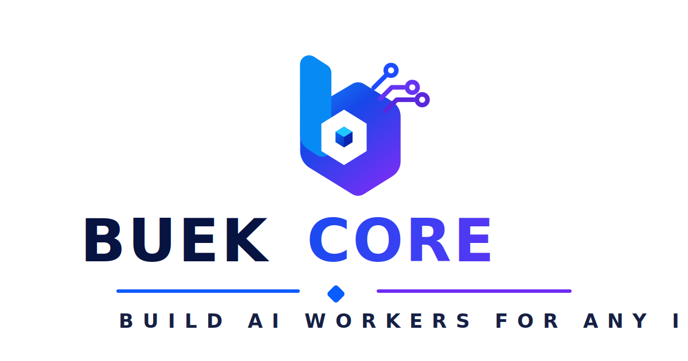
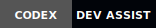
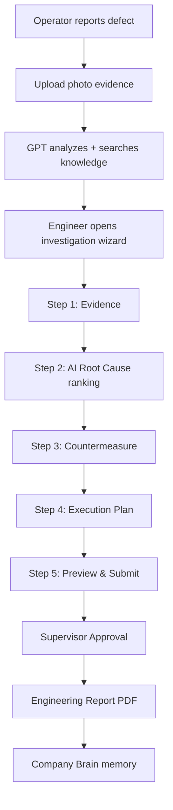

<p align="center">
  
</p>

<p align="center">
  <a href="https://core.buekwebsite.com"><strong>🌐 Live Demo</strong></a>
  &nbsp;·&nbsp;
  <a href="#demo-flow"><strong>🎬 Demo Flow</strong></a>
  &nbsp;·&nbsp;
  <a href="#for-developers"><strong>⚙️ Developer Docs</strong></a>
</p>

<p align="center">
  
  
  
  
  
  
  
</p>

---

## The Problem

Manufacturing teams lose **hours every day** to work that should take minutes:

- Searching historical reports and past investigations  
- Reading SOPs and work instructions under pressure  
- Investigating defects without structured guidance  
- Writing engineering reports from scratch  
- Losing institutional knowledge when engineers rotate  

**Result:** slower recovery, repeated failures, higher operational cost.

---

## Our Solution

**Buek Core** introduces **AI Workers** — role-based digital teammates that combine:

| Capability | What it does |
|------------|--------------|
| **Reasoning** | Ranked root-cause analysis — engineer always decides |
| **Company Knowledge** | SOPs, manuals, issue history, lessons learned |
| **Workflow** | Evidence → Analysis → Approval → Report → Lessons |
| **Organizational Memory** | Every investigation makes the factory smarter |

One platform. One AI Core. **Any industry** — starting with Manufacturing.

---

## Why Buek Core Should Win

| Question | Answer |
|----------|--------|
| **Real problem?** | Engineers spend 2–4 hours per defect investigation — we cut that to a guided 30-minute flow |
| **Unique approach?** | Separates reusable **AI Core** from swappable **Domain Modules** — not another chatbot wrapper |
| **OpenAI used how?** | Root cause ranking, SOP retrieval, report drafting, multi-role copilot, knowledge search |
| **Production-ready?** | Live at [core.buekwebsite.com](https://core.buekwebsite.com) — multi-tenant, role-based, mobile field app |

> We don't replace engineers. We give every role an **AI Worker** that knows their factory.

---

## See It In Action

```
┌─────────────────────────────────────────────────────────────┐
│                      BUEK CORE                              │
│              AI Workers for Manufacturing                   │
│                                                             │
│   [ Login ]  →  [ Choose Tenant ]  →  [ Pick Role ]        │
│                                                             │
│        Operator          Engineer         Supervisor        │
│           │                  │                  │           │
│     Report defect    5-step analysis      Approve report    │
│     Upload photo     AI root causes       1-tap review      │
│           │                  │                  │           │
│           └──────────────────┴──────────────────┘       │
│                              │                              │
│                    Engineering Report (PDF)                   │
│                    Company Brain (memory)                   │
└─────────────────────────────────────────────────────────────┘
```

**Try the live demo:** [https://core.buekwebsite.com](https://core.buekwebsite.com)

| Step | What to do |
|------|------------|
| 1 | Open live demo → choose **Epson / Toyota / Nestlé** tenant |
| 2 | Launch as **Engineer** → open today's investigation |
| 3 | Walk through **5-step wizard** (Evidence → Root Cause → Countermeasure → Plan → Submit) |
| 4 | Switch to **Supervisor** → approve the analysis |
| 5 | Generate **PDF Engineering Report** |

> 🎥 **Demo Video:** _Add your YouTube/Loom link here before submission_

---

## Architecture

```
                         ┌─────────────────────┐
                         │      BUEK CORE      │
                         │    (Reusable AI)    │
                         └──────────┬──────────┘
                                    │
              ┌─────────────────────┼─────────────────────┐
              │                     │                     │
         ┌────▼────┐          ┌─────▼─────┐         ┌─────▼─────┐
         │ Memory  │          │ Knowledge │         │ Workflow  │
         └─────────┘          └───────────┘         └───────────┘
              │                     │                     │
         ┌────▼────┐          ┌─────▼─────┐         ┌─────▼─────┐
         │ Agents  │          │   Tools   │         │  Prompts  │
         └─────────┘          └───────────┘         └───────────┘
                                    │
                         ┌──────────▼──────────┐
                         │ Manufacturing Module │  ← first vertical
                         │  SOP · KPI · Issues  │
                         └──────────┬──────────┘
                                    │
         ┌──────────────┬───────────┼───────────┬──────────────┐
         │              │           │           │              │
    ┌────▼────┐   ┌─────▼────┐ ┌───▼───┐  ┌────▼────┐   ┌─────▼─────┐
    │Operator │   │ Engineer │ │Super- │  │ Plant   │   │  Mobile   │
    │         │   │          │ │visor  │  │ Manager │   │ Field App │
    └─────────┘   └──────────┘ └───────┘  └─────────┘   └───────────┘
```

**Key design:** AI Core never contains industry knowledge. Each vertical is a **Domain Module** plugged in at runtime.

---

## Powered by OpenAI

OpenAI GPT powers the intelligence layer across the platform:

| Feature | How GPT is used |
|---------|-----------------|
| ✓ **Root Cause Analysis** | Ranked possible causes with confidence scores — engineer selects |
| ✓ **SOP Understanding** | Retrieves and explains relevant procedures for the current issue |
| ✓ **Report Generation** | Drafts structured engineering investigation reports |
| ✓ **Knowledge Retrieval** | Semantic search across SOPs, manuals, lessons learned |
| ✓ **AI Copilot** | Role-aware assistant (Operator / Engineer / Supervisor / Manager) |
| ✓ **Multi-agent reasoning** | Investigation co-pilot + workflow agents + knowledge agents |

```text
Operator uploads evidence
        ↓
GPT analyzes context + machine history
        ↓
Knowledge Search (SOP + similar cases)
        ↓
Engineer selects root cause (AI suggests, human decides)
        ↓
GPT drafts countermeasure + execution plan
        ↓
Supervisor reviews & approves
        ↓
Official Engineering Report (PDF/DOCX)
        ↓
Stored in Company Brain → smarter next time
```

Default model: `gpt-5.6` via OpenAI API (Codex + GPT 5.6) · configurable per deployment with `OPENAI_MODEL`.

---

## Demo Flow

<a id="demo-flow"></a>



| Role | Mobile (field) | Desktop (office) |
|------|----------------|------------------|
| **Operator** | Report defect, photo upload, checklist | — |
| **Engineer** | Guided stepper, AI copilot | Full analysis wizard, document preview |
| **Supervisor** | Quick approve / request revision | Approval queue, team overview |
| **Plant Manager** | KPI alerts | Executive dashboard, reports |

---

## Built With

| | |
|---|---|
| **AI** | OpenAI API · GPT-4.1+ · Codex (development) |
| **Frontend** | React 19 · TypeScript · Vite · Tailwind CSS v4 |
| **Backend** | Node.js · Express · Prisma ORM |
| **Database** | PostgreSQL |
| **Infra** | Docker Compose · Nginx · GitHub Actions CI/CD |
| **Live** | [core.buekwebsite.com](https://core.buekwebsite.com) |

---

## Future Vision

**One AI Core. Unlimited Industries.**

| Industry | Status |
|----------|--------|
| 🏭 **Manufacturing** | ✅ Live demo (Epson, Toyota, Nestlé) |
| 🏥 Healthcare | 🔜 Planned |
| 🏗️ Construction | 🔜 Planned |
| ⛏️ Mining | 🔜 Planned |
| ⚡ Energy | 🔜 Planned |
| 🏛️ Government | 🔜 Planned |
| 🌐 Website Builder | 🔜 Planned |
| 🎓 Education | 🔜 Planned |

Add a new vertical = ship a **Domain Module**. AI Core stays the same.

---

## Demo Tenants

| Tenant | Industry | Sample Issue |
|--------|----------|--------------|
| Epson Indonesia | Printer Manufacturing | White Streak defect |
| Toyota Indonesia | Automotive | Torque drift EA-04 |
| Nestlé Indonesia | Food & Beverage | Metal detector alarm |

Login → pick tenant → pick role → launch.

---

<a id="for-developers"></a>

## For Developers

<details>
<summary><strong>Quick Start (local)</strong></summary>

```bash
git clone https://github.com/abdularief23/buek-core.git
cd buek-core
pnpm install && cp .env.example .env
# Set OPENAI_API_KEY in .env

pnpm db:generate && pnpm db:migrate && pnpm db:seed
pnpm dev
```

| Service | URL |
|---------|-----|
| Web | http://localhost:5173 |
| API | http://localhost:4000 |

</details>

<details>
<summary><strong>Project Structure</strong></summary>

```text
apps/web/          React UI — role homes, wizard, copilot
apps/api/          Express API — workflows, engineering analysis
domains/manufacturing/   First domain module
packages/ai-core/  Reusable AI platform (no domain knowledge)
packages/knowledge/  RAG-ready knowledge layer
packages/agents/   Agent system
docker/            Production containers
```

See [docs/architecture.md](docs/architecture.md) for full details.

</details>

<details>
<summary><strong>Deployment</strong></summary>

Production runs at **https://core.buekwebsite.com** via Docker Compose.

Auto-deploy: push to `main` → GitHub Actions (set `VPS_HOST`, `VPS_USER`, `SSH_PRIVATE_KEY`).

Manual fallback: [deploy/MANUAL-DEPLOY.md](deploy/MANUAL-DEPLOY.md) · Full guide: [docs/deployment.md](docs/deployment.md)

</details>

<details>
<summary><strong>Key API Endpoints</strong></summary>

| Endpoint | Purpose |
|----------|---------|
| `POST /api/auth/demo-launch` | Start demo session |
| `GET /api/data/:slug/issues/:key/analysis` | Engineering analysis + AI copilot |
| `POST /api/data/:slug/issues/:key/analysis/submit` | Submit to supervisor |
| `GET /api/data/:slug/issues/:key/analysis/document` | Export report HTML/PDF |
| `GET /api/data/:slug/company-brain` | Organizational memory |
| `GET /api/knowledge/search` | Knowledge base search |

</details>

---

## License

Private — © Buek Core. Contact maintainer for access.
