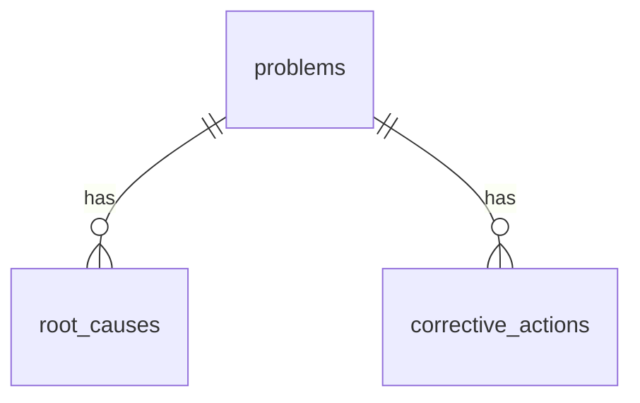

# AMP — `src/db/schema.ts`

> **Status:** ⏳ Menunggu source — template siap diisi  
> **Parent:** [`CODEBASE_GUIDE.md`](../analisis-masalah-pabrik-CODEBASE_GUIDE.md)

---

## Ringkasan domain

```text
Problem (parent)
├── root_causes
├── corrective_actions
├── problem_activities
├── kaizen_steps
└── (optional) downtime link

daily_production  — analitik
downtime          — analitik / optional problem link
```

_Isi diagram aktual setelah baca `schema.ts`._

---

## Daftar tabel

| # | Tabel | Purpose (1 line) | Doc section |
|---|-------|------------------|-------------|
| 1 | `problems` | _TBD_ | § problems |
| 2 | `root_causes` | _TBD_ | § root_causes |
| 3 | _TBD_ | _TBD_ | |

---

## Relasi ER (isi setelah audit)



_Ganti dengan relasi aktual dari Drizzle schema._

---

<!-- Salin template di bawah untuk SETIAP tabel -->

## `problems`

**Purpose:**  
_TBD — mengapa entitas Problem ada terpisah dari "ticket" generik_

**Parent / children:**
- Parent: none (root entity)
- Children: `root_causes`, `corrective_actions`, `problem_activities`, `kaizen_steps`

**Key fields:**

| Field | Tipe | Mengapa ada | Validasi (CHECK / app) |
|-------|------|-------------|------------------------|
| `id` | _TBD_ | _TBD_ | _TBD_ |
| `description` | _TBD_ | _TBD_ | _TBD_ |
| `status` | _TBD_ | _TBD_ | _TBD_ |
| `priority` | _TBD_ | _TBD_ | _TBD_ |
| `area` | text | _TBD — string vs FK master data_ | _TBD_ |
| `occurred_at` | _TBD_ | _TBD_ | _TBD_ |
| _…_ | | | |

**Business invariants:**
- _TBD_

**Used by (worker):**
- `createProblem()` — INSERT
- _TBD_

**AI context:**
- Stage 1–2: description + metadata
- _TBD_

**Potensi pengembangan:**
- FK ke `areas`, `lines`, `machines` (ARCHITECTURE_REVIEW Sprint B)
- Kolom `ai_understanding` JSON (AI Sprint)
- Index: `status`, `occurred_at`

---

## `root_causes`

**Purpose:**  
_TBD_

_(Ulangi template untuk setiap tabel — hapus komentar ini setelah selesai)_

---

## Enum & CHECK constraints

| Constraint | Values | Migration | Dampak AI |
|------------|--------|-----------|-----------|
| `problems.priority` | _TBD_ | _TBD_ | _TBD_ |
| `problems.status` | _TBD_ | _TBD_ | _TBD_ |

---

## Gap schema vs AI_COPILOT (preview)

| Kebutuhan AI | Ada di schema? | Catatan |
|--------------|----------------|---------|
| `problem_similar_cases` | _TBD_ | Stage 2 |
| `ai_understanding` | _TBD_ | Stage 1 |
| `investigation_answers` | _TBD_ | Stage 3 |
| `attachments` / evidence | _TBD_ | Stage 8 |
| Knowledge review status | _TBD_ | Audit 20 |
