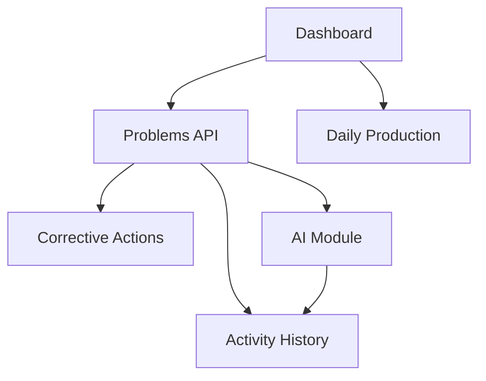

# Analisis Masalah Pabrik — Worker Audit (`worker/index.ts`)

> **Status:** ⏳ **MENUNGGU SOURCE** — audit belum bisa diisi sampai `worker/index.ts` di-import ke repo  
> **Tanggal kerangka:** 2026-07-27  
> **Gate:** Sprint AI-1 **DIBLOKIR** sampai dokumen ini selesai diisi (semua Audit 1–10)

**Konteks terkait:**

- [`PROJECT_CONTEXT.md`](./analisis-masalah-pabrik-PROJECT_CONTEXT.md)
- [`ARCHITECTURE_REVIEW.md`](./analisis-masalah-pabrik-ARCHITECTURE_REVIEW.md)
- [`AI_COPILOT.md`](./analisis-masalah-pabrik-AI_COPILOT.md)

---

## Mengapa audit ini wajib sebelum Sprint AI-1

Kalau langsung mengerjakan Sprint AI-1, kita berisiko membuat fitur AI yang **bertabrakan** dengan arsitektur yang sudah ada. `worker/index.ts` mungkin sudah punya event flow, helper, atau service yang bisa dipakai ulang.

**Prinsip:** Reverse engineering dulu → baru desain integrasi AI berdasarkan **kondisi kode sebenarnya**, bukan asumsi.

```
❌ Asumsi → implement AI → tabrakan arsitektur
✅ Audit worker → temukan hook yang ada → Sprint AI-1 presisi
```

---

## Prasyarat: import source

Audit membutuhkan file berikut (dari ZIP Vantis/AMP):

| File / folder | Untuk audit |
|---------------|-------------|
| `worker/index.ts` | Audit 1–10 (utama) |
| `worker/**/*.ts` | Jika sudah dipecah |
| `src/db/schema.ts` | Audit 5, 7 (knowledge & decision boundary) |
| `migrations/` | Konfirmasi tabel yang tersedia untuk AI context |
| `.jatevo/agent-memory.json` | Requirement AI asli dari builder |
| `wrangler.jsonc` | Binding AI (env, secrets, AI gateway) |
| `src/**/*.ts` | Frontend AI calls (fetch ke worker) |

**Lokasi target di monorepo (disarankan):**

```text
apps/amp/
├── worker/index.ts
├── src/
├── migrations/
└── wrangler.jsonc
```

Setelah import, jalankan audit dan isi semua section `<!-- HASIL -->` di bawah.

---

## Struktur deliverable akhir

```text
worker/index.ts
│
├── 1. Endpoint Map
├── 2. Database Flow (per operasi bisnis)
├── 3. AI Flow (jika ada)
├── 4. Prompt Review (jika ada)
├── 5. Event Lifecycle
├── 6. Knowledge Flow
├── 7. Decision Boundary
├── 8. Dependency Graph
├── 9. Sequence Diagram
├── 10. Refactor Recommendation
├── 11. AI Integration Points (rekomendasi hook)
└── 12. Sprint Recommendation (post-audit)
```

---

## Ringkasan eksekutif (isi setelah audit)

| Metrik | Nilai | Catatan |
|--------|-------|---------|
| Total baris `worker/index.ts` | _TBD_ | |
| Jumlah endpoint | _TBD_ | |
| Pemanggilan AI ditemukan | _TBD_ | 0 = belum ada di worker |
| AI trigger on `problem.created` | _TBD_ | Ya / Tidak |
| Decision boundary benar | _TBD_ | Suggestion vs auto-write |
| Stage AI 1–10 (dari AI_COPILOT) | _TBD_ | X/10 implemented |
| Rekomendasi refactor prioritas | _TBD_ | Module pertama yang dipecah |
| Sprint AI-1 siap? | **Tidak** | Tunggu audit selesai |

---

# Audit 1 — Entry Point (Endpoint Map)

**Tujuan:** Peta seluruh lifecycle HTTP aplikasi.

**Cara audit:** Cari pola:

- `fetch()` (di frontend — cross-ref)
- `route`, `switch(path)`, `router`
- `app.get()`, `app.post()`, `app.put()`, `app.delete()`
- Handler function names

### Endpoint Map

| Method | Path | Handler | Validasi | Service/DB | Side effects | AI? |
|--------|------|---------|----------|------------|--------------|-----|
| _TBD_ | _TBD_ | _TBD_ | _TBD_ | _TBD_ | _TBD_ | _TBD_ |

### Diagram lifecycle (contoh format)

```text
POST /api/problems
    ↓
validate()
    ↓
insertProblem()
    ↓
generateKaizen()    ← ensureKaizen()?
    ↓
??? AI trigger ???
    ↓
return JSON
```

### Temuan Audit 1

<!-- HASIL -->
- _Belum diisi — menunggu source_

---

# Audit 2 — Business Flow (telusuri per operasi)

**Tujuan:** Untuk setiap operasi utama, telusuri sampai selesai.

**Operasi wajib ditelusuri:**

- [ ] `createProblem` / `POST problems`
- [ ] `updateProblem` / `PUT problem/:id`
- [ ] `deleteProblem`
- [ ] `createRootCause`
- [ ] `createCorrectiveAction`
- [ ] `updateKaizen`
- [ ] `createDowntime` / `dailyProduction`
- [ ] `GET dashboard`

### Contoh: `createProblem()` flow

```text
createProblem()
    ↓
insert database          → tabel: problems
    ↓
activity log             → tabel: problem_activities (?)
    ↓
generate kaizen          → ensureKaizen() — 8 steps (?)
    ↓
AI ?                     → [YA / TIDAK — isi setelah audit]
    ↓
notification ?           → [YA / TIDAK]
    ↓
response
```

### Business Flow Matrix

| Operasi | Insert DB | Activity log | Kaizen auto | AI | Notif | Response shape |
|---------|-----------|--------------|-------------|-----|-------|------------------|
| createProblem | _TBD_ | _TBD_ | _TBD_ | _TBD_ | _TBD_ | _TBD_ |
| updateProblem | _TBD_ | _TBD_ | — | _TBD_ | _TBD_ | _TBD_ |
| _..._ | | | | | | |

### Temuan Audit 2

<!-- HASIL -->
- _Belum diisi_

**Kesimpulan Stage AI:** Jika setelah insert **belum ada AI trigger** → Stage 1–2 di [`AI_COPILOT.md`](./analisis-masalah-pabrik-AI_COPILOT.md) **belum ada**.

---

# Audit 3 — AI Entry (semua pemanggilan model)

**Tujuan:** Temukan setiap titik yang memanggil LLM atau layanan AI.

**Pola pencarian (grep):**

```text
openai | google | gemini | anthropic | claude | gpt
fetch(.*ai | llm | chat | prompt | model
@cf/ai | AI binding | env.OPENAI
workers-ai | vectorize | embedding
```

**Scope:** `worker/`, `src/`, `wrangler.jsonc`, `.jatevo/`

### AI Entry Table

| Lokasi (file:line) | Fungsi | Trigger | Input data | Output | Disimpan ke DB? | Stage AI (1–10) |
|--------------------|--------|---------|------------|--------|-----------------|-----------------|
| _TBD_ | _TBD_ | _TBD_ | _TBD_ | _TBD_ | _TBD_ | _TBD_ |

### Jika tidak ada baris di tabel

→ **AI belum masuk Worker** (mungkin hanya di frontend, atau belum diimplementasi sama sekali).

### Temuan Audit 3

<!-- HASIL -->
- _Belum diisi_

---

# Audit 4 — Prompt Analysis

**Tujuan:** Bedah setiap prompt — kualitas, risiko hallucination, perbaikan.

**Hanya diisi jika Audit 3 menemukan prompt.**

### Prompt Inventory

| ID | Lokasi | Prompt (ringkas) | Tujuan | Kelemahan | Risiko hallucination | Rekomendasi perbaikan |
|----|--------|------------------|--------|-----------|----------------------|----------------------|
| P1 | _TBD_ | _TBD_ | _TBD_ | _TBD_ | _TBD_ | _TBD_ |

### Checklist kualitas prompt manufacturing

- [ ] Menyebutkan bahwa output adalah **saran**, bukan keputusan final
- [ ] Meminta **ranked causes** dengan confidence, bukan satu jawaban
- [ ] Meminta **evidence bullets** dari data yang diberikan
- [ ] Membatasi konteks ke data yang dikirim (tidak mengarang SOP)
- [ ] Bahasa output sesuai UI (ID/EN)
- [ ] Structured output (JSON schema) vs free text

### Temuan Audit 4

<!-- HASIL -->
- _Belum diisi — atau "N/A — tidak ada prompt ditemukan"_

---

# Audit 5 — Knowledge Flow (apa yang dibaca AI?)

**Tujuan:** Tentukan apakah AI hanya membaca Problem atau seluruh histori.

### Data sources yang seharusnya dibaca AI

```text
Problem
  ├── Root Cause(s)
  ├── Corrective Action(s)
  ├── Activity log
  ├── Downtime (linked)
  ├── Daily Production (konteks)
  └── Kaizen steps
```

### Knowledge Flow Matrix

| Data source | Tersedia di schema | Dibaca worker (non-AI) | Dikirim ke AI | Cara (join / query terpisah) |
|-------------|-------------------|------------------------|---------------|------------------------------|
| problems | ✅ | _TBD_ | _TBD_ | _TBD_ |
| root_causes | ✅ | _TBD_ | _TBD_ | _TBD_ |
| corrective_actions | ✅ | _TBD_ | _TBD_ | _TBD_ |
| problem_activities | ✅ | _TBD_ | _TBD_ | _TBD_ |
| downtime | ✅ | _TBD_ | _TBD_ | _TBD_ |
| daily_production | ✅ | _TBD_ | _TBD_ | _TBD_ |
| kaizen | ✅ | _TBD_ | _TBD_ | _TBD_ |

### Temuan Audit 5

<!-- HASIL -->
- _Belum diisi_

**Rule of thumb:** Jika AI hanya membaca `problem.description` → hasil pasti kurang bagus. Sprint AI-1 harus menyertakan minimal Problem + similar history + production/downtime context.

---

# Audit 6 — Memory (strategi konteks AI)

**Tujuan:** Identifikasi mekanisme memori / retrieval.

### Memory Strategy Matrix

| Strategi | Ditemukan? | Lokasi | Kualitas untuk manufacturing |
|----------|------------|--------|------------------------------|
| Current Problem only | _TBD_ | _TBD_ | Rendah |
| Current + SQL history (similar cases) | _TBD_ | _TBD_ | Sedang |
| Full-text search (D1 FTS) | _TBD_ | _TBD_ | Sedang |
| Vector / embedding search | _TBD_ | _TBD_ | Tinggi |
| External knowledge (SOP/manual) | _TBD_ | _TBD_ | Tinggi |
| Session/chat memory | _TBD_ | _TBD_ | Variabel |

### Temuan Audit 6

<!-- HASIL -->
- _Belum diisi_

**Rekomendasi post-audit:** _FTS dulu di D1 → bridge ke Buek Core `packages/memory` untuk production._

---

# Audit 7 — Decision Boundary (sangat kritis)

**Tujuan:** Pastikan AI tidak langsung menulis keputusan engineer ke database.

### Pola yang benar ✅

```text
AI → Suggestion (JSON) → Engineer memilih → Database berubah
```

### Pola yang salah ❌

```text
AI → langsung UPDATE root_causes / corrective_actions / problems.status
```

### Decision Boundary Table

| Operasi AI | Output AI | Siapa commit ke DB? | Tabel yang berubah | Pola | Status |
|------------|-----------|---------------------|-------------------|------|--------|
| _TBD_ | _TBD_ | _TBD_ | _TBD_ | ✅/❌ | _TBD_ |

### Temuan Audit 7

<!-- HASIL -->
- _Belum diisi_

**Gate Sprint AI-1:** Semua integrasi AI baru **wajib** pola ✅. Jika kode existing pakai pola ❌ → refactor dulu atau flag sebagai tech debt.

---

# Audit 8 — Event Flow (diagram lifecycle)

**Tujuan:** Bandingkan event flow **actual** vs **target** (AI_COPILOT).

### Actual (isi setelah audit)

```text
Problem Created
    ↓
Insert DB
    ↓
??? 
    ↓
Response
```

### Target (dari AI_COPILOT.md)

```text
Problem Created
    ↓
Insert DB
    ↓
Activity log
    ↓
AI Stage 1 — Understanding
    ↓
AI Stage 2 — Similar Case
    ↓
Response (+ similar cases in payload)
    ↓
(later) status → in_progress → Stage 3 Investigation Q
    ↓
...
```

### Event Flow Gap

| Event | Actual | Target | Gap |
|-------|--------|--------|-----|
| `problem.created` | _TBD_ | AI 1–2 async | _TBD_ |
| `problem.in_progress` | _TBD_ | AI 3 questions | _TBD_ |
| `root_cause.selected` | _TBD_ | AI 6 action rec | _TBD_ |
| `actions.completed` | _TBD_ | AI 8 verify | _TBD_ |
| `problem.closed` | _TBD_ | AI 9 lesson learned | _TBD_ |

### Temuan Audit 8

<!-- HASIL -->
- _Belum diisi_

---

# Audit 9 — Dependency Graph

**Tujuan:** Peta ketergantungan agar penambahan AI tidak merusak Dashboard / modul lain.

### Dependency Graph (isi setelah audit)



_Ganti diagram di atas dengan ketergantungan **aktual** dari kode._

### Coupling Risk Table

| Modul | Bergantung pada | Risiko jika AI ditambah | Mitigasi |
|-------|-----------------|-------------------------|----------|
| Dashboard | _TBD_ | _TBD_ | _TBD_ |
| createProblem | _TBD_ | _TBD_ | _TBD_ |
| _TBD_ | | | |

### Temuan Audit 9

<!-- HASIL -->
- _Belum diisi_

---

# Audit 10 — Refactor Opportunity

**Tujuan:** Penilaian struktur file dan rekomendasi pemecahan modul.

### Metrik file

| File | Baris | Fungsi | Query SQL | Handler HTTP | Business logic | Mapping |
|------|-------|--------|-----------|--------------|----------------|---------|
| `worker/index.ts` | _TBD_ | _TBD_ | _TBD_ | _TBD_ | _TBD_ | _TBD_ |

### Target struktur (dari ARCHITECTURE_REVIEW)

```text
worker/index.ts (~200 baris, dispatch only)
    ↓
routes/problems.ts
routes/dashboard.ts
routes/production.ts
    ↓
services/problem.service.ts
services/ai/similar-case.service.ts
    ↓
repositories/problem.repo.ts
    ↓
mappers/problem.mapper.ts
lib/response.ts
```

### Refactor Findings

| # | Masalah | Lokasi (line) | Rekomendasi | Prioritas |
|---|---------|---------------|-------------|-----------|
| 1 | _TBD_ | _TBD_ | _TBD_ | P0/P1/P2 |

### Duplikasi terdeteksi

<!-- HASIL -->
- _Belum diisi_

### Fungsi yang bisa dipakai ulang untuk AI

<!-- HASIL: daftar helper existing yang Sprint AI-1 harus reuse, bukan duplikasi -->
- _TBD_

### Temuan Audit 10

<!-- HASIL -->
- _Belum diisi_

---

# 11. AI Integration Points (rekomendasi setelah audit)

**Diisi setelah Audit 1–10.** Titik hook terbaik untuk setiap Stage AI tanpa merusak flow existing.

| Stage | Hook function / event | File:line (existing) | Perlu buat baru? | Reuse dari existing |
|-------|----------------------|----------------------|------------------|---------------------|
| 1 Understanding | `problem.created` | _TBD_ | _TBD_ | _TBD_ |
| 2 Similar Case | `problem.created` | _TBD_ | _TBD_ | _TBD_ |
| 3 Investigation Q | `status → in_progress` | _TBD_ | _TBD_ | _TBD_ |
| 4 RCA Suggest | after investigation answers | _TBD_ | _TBD_ | _TBD_ |
| 5 Knowledge | on demand | _TBD_ | _TBD_ | _TBD_ |
| 6 Action Rec | after root cause selected | _TBD_ | _TBD_ | _TBD_ |
| 7 Risk | before close | _TBD_ | _TBD_ | _TBD_ |
| 8 Verify | actions completed | _TBD_ | _TBD_ | _TBD_ |
| 9 Lesson | `problem.closed` | _TBD_ | _TBD_ | _TBD_ |
| 10 Next time | Stage 2 index | _TBD_ | _TBD_ | _TBD_ |

---

# 12. Sprint Recommendation (post-audit only)

**Jangan isi sebelum Audit 1–10 selesai.**

### Urutan sprint yang disarankan (template)

```text
Sprint 0 — Worker audit ✅ (dokumen ini)
    ↓
Sprint A — Refactor hook yang sudah ada (jika Audit 10 menemukan modul siap dipisah)
    ↓
Sprint AI-1 — Hanya hook yang sudah teridentifikasi di §11
    ↓
Sprint B+ — Master data, indexes, dll. (parallel jika tidak bentrok)
```

### Sprint AI-1 scope (isi setelah audit)

| Task | Masuk AI-1? | Alasan |
|------|-------------|--------|
| _TBD_ | Ya/Tidak | _TBD_ |

### Yang TIDAK boleh masuk Sprint AI-1

- Fitur AI yang bentrok dengan handler existing (tanpa refactor)
- Duplikasi helper yang sudah ada di worker
- Auto-write ke DB tanpa engineer confirm

---

## Checklist penyelesaian audit

- [ ] Source di-import ke `apps/amp/` (atau path yang disepakati)
- [ ] Audit 1 — Endpoint Map lengkap
- [ ] Audit 2 — Business flow semua operasi utama
- [ ] Audit 3 — AI Entry (atau dikonfirmasi nol temuan)
- [ ] Audit 4 — Prompt Analysis (atau N/A)
- [ ] Audit 5 — Knowledge Flow matrix
- [ ] Audit 6 — Memory strategy
- [ ] Audit 7 — Decision boundary ✅/❌ per operasi
- [ ] Audit 8 — Event flow actual vs target
- [ ] Audit 9 — Dependency graph
- [ ] Audit 10 — Refactor recommendations
- [ ] §11 AI Integration Points
- [ ] §12 Sprint Recommendation
- [ ] Update status matrix di [`AI_COPILOT.md`](./analisis-masalah-pabrik-AI_COPILOT.md)
- [ ] **Gate lifted:** Sprint AI-1 boleh dimulai

---

## Cara menjalankan audit (untuk Cursor / kontributor)

1. Import source AMP
2. Baca `worker/index.ts` dari atas ke bawah — buat Endpoint Map (Audit 1)
3. Untuk setiap `POST`/`PUT` penting, trace function calls (Audit 2)
4. `rg -i "openai|gemini|anthropic|llm|prompt|@cf/ai|embedding" worker/ src/` (Audit 3–4)
5. Untuk setiap AI call, trace input query — tabel mana yang di-SELECT (Audit 5–6)
6. Cek apakah AI output → `INSERT`/`UPDATE` langsung atau return JSON dulu (Audit 7)
7. Gambar sequence actual vs target (Audit 8)
8. Catat import/call graph antar handler (Audit 9)
9. Hitung baris, duplikasi, rekomendasi split (Audit 10)
10. Isi §11–12 → update AI_COPILOT status matrix → lift gate

---

*Dokumen ini adalah gate wajib sebelum Sprint AI-1. Jangan implementasi fitur AI di worker sampai checklist penyelesaian audit tercentang.*
