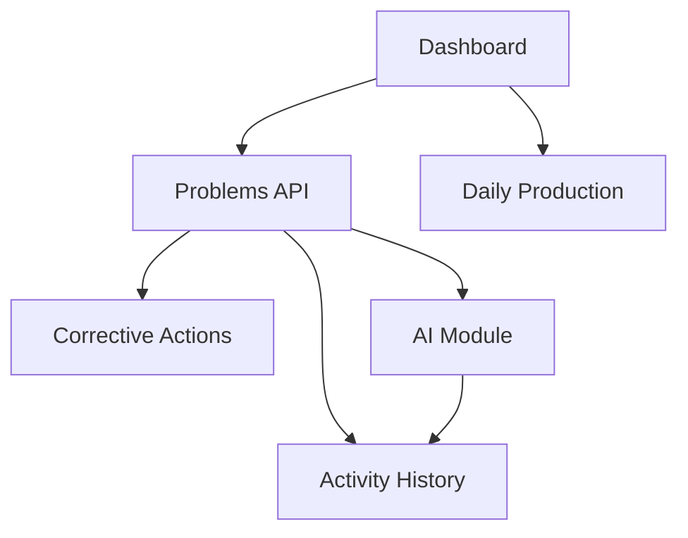

# Analisis Masalah Pabrik — Worker Audit (`worker/index.ts`)

> **Status:** ⏳ **MENUNGGU SOURCE** — audit belum bisa diisi sampai `worker/index.ts` di-import ke repo  
> **Tanggal kerangka:** 2026-07-27 (diperbarui: +Audit 11–18 knowledge & AI quality)  
> **Gate:** Sprint AI-1 **DIBLOKIR** sampai **semua Audit P0** selesai (lihat prioritas di bawah)

**Konteks terkait:**

- [`PROJECT_CONTEXT.md`](./analisis-masalah-pabrik-PROJECT_CONTEXT.md)
- [`ARCHITECTURE_REVIEW.md`](./analisis-masalah-pabrik-ARCHITECTURE_REVIEW.md)
- [`AI_COPILOT.md`](./analisis-masalah-pabrik-AI_COPILOT.md)

---

## Dua dimensi audit

Dokumen ini bukan sekadar review kode — ini **framework evaluasi AI Manufacturing**:

| Dimensi | Audit | Fokus |
|---------|-------|-------|
| **Kode & arsitektur** | 1–10 | Endpoint, flow, AI entry, event, dependency, refactor |
| **Pengetahuan & AI quality** | 11–18 | Domain rules, data quality, retrieval, explainability, learning loop |

Keberhasilan AI di proyek ini lebih banyak ditentukan oleh **kualitas alur, data, dan pengambilan keputusan** daripada sekadar implementasi model.

---

## Prioritas audit (dampak untuk AI Manufacturing)

### P0 — Wajib sebelum Sprint AI-1 (gate)

| Audit | Nama |
|-------|------|
| 5 | Knowledge Flow |
| 6 | Memory Strategy |
| 7 | Decision Boundary |
| 12 | Knowledge Quality |
| 13 | Retrieval Readiness |

Plus **minimum kode** agar hook AI teridentifikasi: Audit **1, 2, 3, 8**.

### P1 — Sebelum AI digunakan luas (production pilot)

| Audit | Nama |
|-------|------|
| 11 | Domain Rule |
| 14 | AI Explainability |
| 15 | Human-in-the-Loop |

### P2 — Peningkatan berkelanjutan

| Audit | Nama |
|-------|------|
| 4 | Prompt Analysis (jika AI sudah ada) |
| 9 | Dependency Graph |
| 10 | Refactor Opportunity |
| 16 | Learning Loop |
| 17 | AI Confidence |
| 18 | Knowledge Coverage |

**Gate Sprint AI-1:** P0 checklist ✅ + Deliverable A (integration points) + Deliverable B (sprint scope).

## Mengapa audit ini wajib sebelum Sprint AI-1

Kalau langsung mengerjakan Sprint AI-1, kita berisiko membuat fitur AI yang **bertabrakan** dengan arsitektur yang sudah ada. `worker/index.ts` mungkin sudah punya event flow, helper, atau service yang bisa dipakai ulang.

**Prinsip:** Reverse engineering dulu → baru desain integrasi AI berdasarkan **kondisi kode sebenarnya**, bukan asumsi.

```
❌ Asumsi → implement AI → tabrakan arsitektur
✅ Audit worker → temukan hook yang ada → Sprint AI-1 presisi
```

---

## Prasyarat: import source

Audit membutuhkan file berikut (dari ZIP Vantis/AMP):

| File / folder | Untuk audit |
|---------------|-------------|
| `worker/index.ts` | Audit 1–10 (kode & arsitektur) |
| `worker/**/*.ts` | Jika sudah dipecah |
| `src/db/schema.ts` | Audit 5, 7, 11, 13, 18 |
| `migrations/` | CHECK constraints, domain rules (Audit 11) |
| `seeds/local.sql` | Sampel kualitas data (Audit 12) |
| `.jatevo/agent-memory.json` | Requirement AI asli dari builder |
| `wrangler.jsonc` | Binding AI (env, secrets, AI gateway) |
| `src/**/*.ts` | Frontend AI calls, HITL UI (Audit 15) |

**Lokasi target di monorepo (disarankan):**

```text
apps/amp/
├── worker/index.ts
├── src/
├── migrations/
└── wrangler.jsonc
```

Setelah import, jalankan audit dan isi semua section `<!-- HASIL -->` di bawah.

---

## Struktur deliverable akhir

```text
worker/index.ts + schema + seeds
│
├── KODE & ARSITEKTUR (Audit 1–10)
│   ├── 1. Endpoint Map
│   ├── 2. Database / Business Flow
│   ├── 3. AI Flow (entry points)
│   ├── 4. Prompt Review
│   ├── 5. Knowledge Flow          ⭐ P0
│   ├── 6. Memory Strategy         ⭐ P0
│   ├── 7. Decision Boundary       ⭐ P0
│   ├── 8. Event Lifecycle
│   ├── 9. Dependency Graph
│   └── 10. Refactor Recommendation
│
├── PENGETAHUAN & AI QUALITY (Audit 11–18)
│   ├── 11. Domain Rule Audit
│   ├── 12. Knowledge Quality      ⭐ P0
│   ├── 13. Retrieval Readiness    ⭐ P0
│   ├── 14. AI Explainability
│   ├── 15. Human-in-the-Loop
│   ├── 16. Learning Loop
│   ├── 17. AI Confidence
│   └── 18. Knowledge Coverage
│
└── DELIVERABLE
    ├── A. AI Integration Points
    ├── B. Sprint Recommendation
    └── C. Update AI_COPILOT status matrix
```

---

## Ringkasan eksekutif (isi setelah audit)

| Metrik | Nilai | Catatan |
|--------|-------|---------|
| Total baris `worker/index.ts` | _TBD_ | |
| Jumlah endpoint | _TBD_ | |
| Pemanggilan AI ditemukan | _TBD_ | 0 = belum ada di worker |
| AI trigger on `problem.created` | _TBD_ | Ya / Tidak |
| Decision boundary benar | _TBD_ | Suggestion vs auto-write |
| Domain rules terimplementasi | _TBD_ | Audit 11 — X/Y rules |
| Knowledge quality score | _TBD_ | Audit 12 — rendah/sedang/tinggi |
| Retrieval readiness | _TBD_ | FTS / hybrid / embedding (Audit 13) |
| Knowledge coverage (tahap investigasi) | _TBD_ | Audit 18 — X/Y tahap siap |
| Stage AI 1–10 (dari AI_COPILOT) | _TBD_ | X/10 implemented |
| Rekomendasi refactor prioritas | _TBD_ | Audit 10 |
| Sprint AI-1 siap? | **Tidak** | Tunggu Audit P0 selesai |

---

# Audit 1 — Entry Point (Endpoint Map)

**Tujuan:** Peta seluruh lifecycle HTTP aplikasi.

**Cara audit:** Cari pola:

- `fetch()` (di frontend — cross-ref)
- `route`, `switch(path)`, `router`
- `app.get()`, `app.post()`, `app.put()`, `app.delete()`
- Handler function names

### Endpoint Map

| Method | Path | Handler | Validasi | Service/DB | Side effects | AI? |
|--------|------|---------|----------|------------|--------------|-----|
| _TBD_ | _TBD_ | _TBD_ | _TBD_ | _TBD_ | _TBD_ | _TBD_ |

### Diagram lifecycle (contoh format)

```text
POST /api/problems
    ↓
validate()
    ↓
insertProblem()
    ↓
generateKaizen()    ← ensureKaizen()?
    ↓
??? AI trigger ???
    ↓
return JSON
```

### Temuan Audit 1

<!-- HASIL -->
- _Belum diisi — menunggu source_

---

# Audit 2 — Business Flow (telusuri per operasi)

**Tujuan:** Untuk setiap operasi utama, telusuri sampai selesai.

**Operasi wajib ditelusuri:**

- [ ] `createProblem` / `POST problems`
- [ ] `updateProblem` / `PUT problem/:id`
- [ ] `deleteProblem`
- [ ] `createRootCause`
- [ ] `createCorrectiveAction`
- [ ] `updateKaizen`
- [ ] `createDowntime` / `dailyProduction`
- [ ] `GET dashboard`

### Contoh: `createProblem()` flow

```text
createProblem()
    ↓
insert database          → tabel: problems
    ↓
activity log             → tabel: problem_activities (?)
    ↓
generate kaizen          → ensureKaizen() — 8 steps (?)
    ↓
AI ?                     → [YA / TIDAK — isi setelah audit]
    ↓
notification ?           → [YA / TIDAK]
    ↓
response
```

### Business Flow Matrix

| Operasi | Insert DB | Activity log | Kaizen auto | AI | Notif | Response shape |
|---------|-----------|--------------|-------------|-----|-------|------------------|
| createProblem | _TBD_ | _TBD_ | _TBD_ | _TBD_ | _TBD_ | _TBD_ |
| updateProblem | _TBD_ | _TBD_ | — | _TBD_ | _TBD_ | _TBD_ |
| _..._ | | | | | | |

### Temuan Audit 2

<!-- HASIL -->
- _Belum diisi_

**Kesimpulan Stage AI:** Jika setelah insert **belum ada AI trigger** → Stage 1–2 di [`AI_COPILOT.md`](./analisis-masalah-pabrik-AI_COPILOT.md) **belum ada**.

---

# Audit 3 — AI Entry (semua pemanggilan model)

**Tujuan:** Temukan setiap titik yang memanggil LLM atau layanan AI.

**Pola pencarian (grep):**

```text
openai | google | gemini | anthropic | claude | gpt
fetch(.*ai | llm | chat | prompt | model
@cf/ai | AI binding | env.OPENAI
workers-ai | vectorize | embedding
```

**Scope:** `worker/`, `src/`, `wrangler.jsonc`, `.jatevo/`

### AI Entry Table

| Lokasi (file:line) | Fungsi | Trigger | Input data | Output | Disimpan ke DB? | Stage AI (1–10) |
|--------------------|--------|---------|------------|--------|-----------------|-----------------|
| _TBD_ | _TBD_ | _TBD_ | _TBD_ | _TBD_ | _TBD_ | _TBD_ |

### Jika tidak ada baris di tabel

→ **AI belum masuk Worker** (mungkin hanya di frontend, atau belum diimplementasi sama sekali).

### Temuan Audit 3

<!-- HASIL -->
- _Belum diisi_

---

# Audit 4 — Prompt Analysis

**Tujuan:** Bedah setiap prompt — kualitas, risiko hallucination, perbaikan.

**Hanya diisi jika Audit 3 menemukan prompt.**

### Prompt Inventory

| ID | Lokasi | Prompt (ringkas) | Tujuan | Kelemahan | Risiko hallucination | Rekomendasi perbaikan |
|----|--------|------------------|--------|-----------|----------------------|----------------------|
| P1 | _TBD_ | _TBD_ | _TBD_ | _TBD_ | _TBD_ | _TBD_ |

### Checklist kualitas prompt manufacturing

- [ ] Menyebutkan bahwa output adalah **saran**, bukan keputusan final
- [ ] Meminta **ranked causes** dengan confidence, bukan satu jawaban
- [ ] Meminta **evidence bullets** dari data yang diberikan
- [ ] Membatasi konteks ke data yang dikirim (tidak mengarang SOP)
- [ ] Bahasa output sesuai UI (ID/EN)
- [ ] Structured output (JSON schema) vs free text

### Temuan Audit 4

<!-- HASIL -->
- _Belum diisi — atau "N/A — tidak ada prompt ditemukan"_

---

# Audit 5 — Knowledge Flow (apa yang dibaca AI?) ⭐ P0

**Tujuan:** Tentukan apakah AI hanya membaca Problem atau seluruh histori.

### Data sources yang seharusnya dibaca AI

```text
Problem
  ├── Root Cause(s)
  ├── Corrective Action(s)
  ├── Activity log
  ├── Downtime (linked)
  ├── Daily Production (konteks)
  └── Kaizen steps
```

### Knowledge Flow Matrix

| Data source | Tersedia di schema | Dibaca worker (non-AI) | Dikirim ke AI | Cara (join / query terpisah) |
|-------------|-------------------|------------------------|---------------|------------------------------|
| problems | ✅ | _TBD_ | _TBD_ | _TBD_ |
| root_causes | ✅ | _TBD_ | _TBD_ | _TBD_ |
| corrective_actions | ✅ | _TBD_ | _TBD_ | _TBD_ |
| problem_activities | ✅ | _TBD_ | _TBD_ | _TBD_ |
| downtime | ✅ | _TBD_ | _TBD_ | _TBD_ |
| daily_production | ✅ | _TBD_ | _TBD_ | _TBD_ |
| kaizen | ✅ | _TBD_ | _TBD_ | _TBD_ |

### Temuan Audit 5

<!-- HASIL -->
- _Belum diisi_

**Rule of thumb:** Jika AI hanya membaca `problem.description` → hasil pasti kurang bagus. Sprint AI-1 harus menyertakan minimal Problem + similar history + production/downtime context.

---

# Audit 6 — Memory (strategi konteks AI) ⭐ P0

**Tujuan:** Identifikasi mekanisme memori / retrieval.

### Memory Strategy Matrix

| Strategi | Ditemukan? | Lokasi | Kualitas untuk manufacturing |
|----------|------------|--------|------------------------------|
| Current Problem only | _TBD_ | _TBD_ | Rendah |
| Current + SQL history (similar cases) | _TBD_ | _TBD_ | Sedang |
| Full-text search (D1 FTS) | _TBD_ | _TBD_ | Sedang |
| Vector / embedding search | _TBD_ | _TBD_ | Tinggi |
| External knowledge (SOP/manual) | _TBD_ | _TBD_ | Tinggi |
| Session/chat memory | _TBD_ | _TBD_ | Variabel |

### Temuan Audit 6

<!-- HASIL -->
- _Belum diisi_

**Rekomendasi post-audit:** _FTS dulu di D1 → bridge ke Buek Core `packages/memory` untuk production._

---

# Audit 7 — Decision Boundary (sangat kritis) ⭐ P0

**Tujuan:** Pastikan AI tidak langsung menulis keputusan engineer ke database.

### Pola yang benar ✅

```text
AI → Suggestion (JSON) → Engineer memilih → Database berubah
```

### Pola yang salah ❌

```text
AI → langsung UPDATE root_causes / corrective_actions / problems.status
```

### Decision Boundary Table

| Operasi AI | Output AI | Siapa commit ke DB? | Tabel yang berubah | Pola | Status |
|------------|-----------|---------------------|-------------------|------|--------|
| _TBD_ | _TBD_ | _TBD_ | _TBD_ | ✅/❌ | _TBD_ |

### Temuan Audit 7

<!-- HASIL -->
- _Belum diisi_

**Gate Sprint AI-1:** Semua integrasi AI baru **wajib** pola ✅. Jika kode existing pakai pola ❌ → refactor dulu atau flag sebagai tech debt.

---

# Audit 8 — Event Flow (diagram lifecycle)

**Tujuan:** Bandingkan event flow **actual** vs **target** (AI_COPILOT).

### Actual (isi setelah audit)

```text
Problem Created
    ↓
Insert DB
    ↓
??? 
    ↓
Response
```

### Target (dari AI_COPILOT.md)

```text
Problem Created
    ↓
Insert DB
    ↓
Activity log
    ↓
AI Stage 1 — Understanding
    ↓
AI Stage 2 — Similar Case
    ↓
Response (+ similar cases in payload)
    ↓
(later) status → in_progress → Stage 3 Investigation Q
    ↓
...
```

### Event Flow Gap

| Event | Actual | Target | Gap |
|-------|--------|--------|-----|
| `problem.created` | _TBD_ | AI 1–2 async | _TBD_ |
| `problem.in_progress` | _TBD_ | AI 3 questions | _TBD_ |
| `root_cause.selected` | _TBD_ | AI 6 action rec | _TBD_ |
| `actions.completed` | _TBD_ | AI 8 verify | _TBD_ |
| `problem.closed` | _TBD_ | AI 9 lesson learned | _TBD_ |

### Temuan Audit 8

<!-- HASIL -->
- _Belum diisi_

---

# Audit 9 — Dependency Graph

**Tujuan:** Peta ketergantungan agar penambahan AI tidak merusak Dashboard / modul lain.

### Dependency Graph (isi setelah audit)



_Ganti diagram di atas dengan ketergantungan **aktual** dari kode._

### Coupling Risk Table

| Modul | Bergantung pada | Risiko jika AI ditambah | Mitigasi |
|-------|-----------------|-------------------------|----------|
| Dashboard | _TBD_ | _TBD_ | _TBD_ |
| createProblem | _TBD_ | _TBD_ | _TBD_ |
| _TBD_ | | | |

### Temuan Audit 9

<!-- HASIL -->
- _Belum diisi_

---

# Audit 10 — Refactor Opportunity

**Tujuan:** Penilaian struktur file dan rekomendasi pemecahan modul.

### Metrik file

| File | Baris | Fungsi | Query SQL | Handler HTTP | Business logic | Mapping |
|------|-------|--------|-----------|--------------|----------------|---------|
| `worker/index.ts` | _TBD_ | _TBD_ | _TBD_ | _TBD_ | _TBD_ | _TBD_ |

### Target struktur (dari ARCHITECTURE_REVIEW)

```text
worker/index.ts (~200 baris, dispatch only)
    ↓
routes/problems.ts
routes/dashboard.ts
routes/production.ts
    ↓
services/problem.service.ts
services/ai/similar-case.service.ts
    ↓
repositories/problem.repo.ts
    ↓
mappers/problem.mapper.ts
lib/response.ts
```

### Refactor Findings

| # | Masalah | Lokasi (line) | Rekomendasi | Prioritas |
|---|---------|---------------|-------------|-----------|
| 1 | _TBD_ | _TBD_ | _TBD_ | P0/P1/P2 |

### Duplikasi terdeteksi

<!-- HASIL -->
- _Belum diisi_

### Fungsi yang bisa dipakai ulang untuk AI

<!-- HASIL: daftar helper existing yang Sprint AI-1 harus reuse, bukan duplikasi -->
- _TBD_

### Temuan Audit 10

<!-- HASIL -->
- _Belum diisi_

---

# Audit 11 — Domain Rule Audit ⭐⭐⭐⭐⭐ (P1)

**Tujuan:** AI tidak boleh hanya memahami struktur tabel — AI harus mengikuti **aturan bisnis manufaktur** yang sama dengan engineer.

**Sumber temuan:** `worker/index.ts` (validasi), `migrations/` (CHECK constraints), `schema.ts`, UI guards.

### Pertanyaan audit wajib

| # | Business Rule | Implemented | Missing | Hardcoded | Lokasi (file:line / migration) | AI harus tahu? |
|---|---------------|-------------|---------|-----------|-------------------------------|----------------|
| 1 | Satu Problem boleh >1 Root Cause? | _TBD_ | _TBD_ | _TBD_ | _TBD_ | Ya |
| 2 | Kapan status boleh `closed`? | _TBD_ | _TBD_ | _TBD_ | _TBD_ | Ya |
| 3 | Semua Corrective Action harus selesai sebelum close? | _TBD_ | _TBD_ | _TBD_ | _TBD_ | Ya |
| 4 | Kaizen wajib setelah verifikasi? | _TBD_ | _TBD_ | _TBD_ | _TBD_ | Ya |
| 5 | Siapa berwenang ubah Priority? | _TBD_ | _TBD_ | _TBD_ | _TBD_ | Ya |
| 6 | Downtime selalu terkait Problem? | _TBD_ | _TBD_ | _TBD_ | _TBD_ | Ya |
| 7 | Verification wajib sebelum close? | _TBD_ | _TBD_ | _TBD_ | _TBD_ | Ya |
| 8 | Root Cause harus linked sebelum Action? | _TBD_ | _TBD_ | _TBD_ | _TBD_ | Ya |

### Ringkasan status aturan

```text
Business Rule
├── Implemented   → enforce di worker +/atau DB CHECK
├── Missing       → tidak ada validasi — AI bisa sarankan langkah ilegal
└── Hardcoded     → magic string / if di satu tempat — risiko drift
```

### Dampak ke AI

| Status aturan | Risiko jika AI tidak diberi konteks |
|---------------|-------------------------------------|
| Missing | AI sarankan close tanpa verification |
| Hardcoded | AI tidak tahu rule berubah di branch lain |
| Implemented | Rule bisa di-inject ke system prompt / tool guard |

### Temuan Audit 11

<!-- HASIL -->
- _Belum diisi_

---

# Audit 12 — Knowledge Quality Audit ⭐⭐⭐⭐⭐ (P0)

**Tujuan:** AI hanya sebaik kualitas data yang dimilikinya — **garbage in, garbage out**.

**Sumber:** Sample 10–20 Problem dari `seeds/local.sql` atau production anonymized; inspeksi field di schema + isi aktual.

### Checklist kualitas per entitas

| Field / aspek | Kriteria baik | Kriteria buruk | Sample audit (n=__) | Skor |
|---------------|---------------|----------------|---------------------|------|
| Problem Description | Kalimat lengkap: gejala + frekuensi + konteks | "error", "rusak", satu kata | _TBD_ | _TBD_ |
| Root Cause | Kalimat bermakna, spesifik | "human error", "mesin" | _TBD_ | _TBD_ |
| Corrective Action | Tindakan spesifik + PIC + due date | "perbaiki", tanpa detail | _TBD_ | _TBD_ |
| Lesson Learned | Ada dan actionable | Tidak ada / kosong | _TBD_ | _TBD_ |
| Evidence | Foto, metric, link attachment | Tidak ada | _TBD_ | _TBD_ |
| Metadata | area, line, machine, shift, product | String bebas / kosong | _TBD_ | _TBD_ |

### Skor agregat (isi setelah audit)

| Level | Definisi | Implikasi Sprint AI-1 |
|-------|----------|----------------------|
| **Rendah** | >50% record minim / satu kata | Similar case search tidak berguna — perbaiki data dulu atau enrichment AI Stage 1 |
| **Sedang** | Deskripsi OK, metadata lemah | FTS + metadata filter; prioritaskan master data (Sprint B) |
| **Tinggi** | Deskripsi + metadata + RCA lengkap | Siap Similar Case + embedding |

### Rekomendasi perbaikan data (pre/post AI)

<!-- HASIL -->
- _TBD_

### Temuan Audit 12

<!-- HASIL -->
- _Belum diisi_

---

# Audit 13 — Retrieval Readiness ⭐⭐⭐⭐⭐ (P0)

**Tujuan:** Apakah data **siap** untuk Similar Case Search (Stage 2)?

### Field readiness matrix

| Field | Ada di schema | Terisi konsisten | Dipakai worker | Siap retrieval | Catatan |
|-------|---------------|------------------|----------------|----------------|---------|
| Title / summary | _TBD_ | _TBD_ | _TBD_ | _TBD_ | |
| Description | _TBD_ | _TBD_ | _TBD_ | _TBD_ | |
| Category | _TBD_ | _TBD_ | _TBD_ | _TBD_ | |
| Machine | _TBD_ | _TBD_ | _TBD_ | _TBD_ | |
| Line | _TBD_ | _TBD_ | _TBD_ | _TBD_ | |
| Area | _TBD_ | _TBD_ | _TBD_ | _TBD_ | |
| Shift | _TBD_ | _TBD_ | _TBD_ | _TBD_ | |
| Root Cause (historis) | _TBD_ | _TBD_ | _TBD_ | _TBD_ | |
| Corrective Action (historis) | _TBD_ | _TBD_ | _TBD_ | _TBD_ | |
| Result / outcome (closed) | _TBD_ | _TBD_ | _TBD_ | _TBD_ | |

### Strategi pencarian yang direkomendasikan

| Opsi | Syarat data | Cocok jika… | Rekomendasi |
|------|-------------|-------------|-------------|
| **Full-Text Search (D1 FTS)** | Description + title terisi | <10k problems, MVP | _TBD_ |
| **Metadata filter + FTS** | area/line/machine konsisten | Master data rapi | _TBD_ |
| **Embedding / vector** | Volume besar, synonym banyak | >10k cases | _TBD_ |
| **Hybrid (FTS + vector + metadata)** | Semua field + index | Production enterprise | _TBD_ |
| **Metadata tambahan diperlukan** | Field kosong | Audit 12 rendah | _TBD_ |

### Index / migration yang dibutuhkan

<!-- HASIL -->
- _TBD_

### Temuan Audit 13

<!-- HASIL -->
- _Belum diisi_

---

# Audit 14 — AI Explainability Audit ⭐⭐⭐⭐⭐ (P1)

**Tujuan:** Setiap rekomendasi AI harus punya **dasar yang dapat ditelusuri** — kritis di lingkungan manufaktur.

### Contoh standar

| Kualitas | Contoh |
|----------|--------|
| ✅ Baik | "Kasus mirip Problem #248 — mesin sama (M-312), gejala serupa (garis vertikal), RCA historis: encoder kotor, action sukses 3x" |
| ❌ Buruk | "Kemungkinan bearing rusak." |

### Explainability checklist (per jenis output AI)

| Output AI | Evidence wajib | Ada di implementasi? | Lokasi | Gap |
|-----------|----------------|----------------------|--------|-----|
| Similar case | problem_id, similarity %, alasan match | _TBD_ | _TBD_ | _TBD_ |
| Root cause ranking | evidence bullets dari data | _TBD_ | _TBD_ | _TBD_ |
| Corrective action | link ke cause + historis sukses | _TBD_ | _TBD_ | _TBD_ |
| Knowledge ref | SOP ID, judul, kutipan | _TBD_ | _TBD_ | _TBD_ |
| Verification | before/after metric | _TBD_ | _TBD_ | _TBD_ |

### Temuan Audit 14

<!-- HASIL -->
- _Belum diisi_

**Gate production pilot:** Tidak ada rekomendasi AI tanpa ≥1 evidence bullet yang bisa diklik/ditelusuri.

---

# Audit 15 — Human-in-the-Loop Audit ⭐⭐⭐⭐⭐ (P1)

**Tujuan:** Melengkapi Audit 7 — engineer harus bisa **mengendalikan** keputusan AI, bukan hanya "siapa yang write DB".

### Flow yang diharapkan

```text
AI memberikan N kandidat (mis. 5 Root Cause)
    ↓
Engineer memilih salah satu
    ↓
Engineer boleh mengubah teks
    ↓
Engineer boleh menolak semua → input manual
    ↓
Baru disimpan ke database
```

### HITL capability matrix

| Kemampuan UI/API | Root Cause | Corrective Action | Close Problem | Similar case apply | Status |
|------------------|------------|-------------------|---------------|-------------------|--------|
| Lihat saran AI | _TBD_ | _TBD_ | _TBD_ | _TBD_ | |
| Pilih satu dari list | _TBD_ | _TBD_ | — | _TBD_ | |
| Edit sebelum save | _TBD_ | _TBD_ | — | _TBD_ | |
| Tolak / dismiss | _TBD_ | _TBD_ | — | _TBD_ | |
| Audit: diterima vs ditolak | _TBD_ | _TBD_ | — | _TBD_ | |

### Anti-pattern terdeteksi

- [ ] AI suggestion auto-selected tanpa klik engineer
- [ ] Tidak bisa edit suggestion
- [ ] Tidak ada log "rejected AI suggestion"
- [ ] Chat-only tanpa bind ke Problem entity

### Temuan Audit 15

<!-- HASIL -->
- _Belum diisi_

---

# Audit 16 — Learning Loop Audit ⭐⭐⭐⭐☆ (P2)

**Tujuan:** AI harus **belajar** dari penyelesaian masalah — bukan rekomendasi statis selamanya.

### Pertanyaan audit

| # | Pertanyaan | Ya / Tidak / Partial | Bukti (tabel/flow) |
|---|------------|----------------------|-------------------|
| 1 | Kasus closed masuk knowledge base? | _TBD_ | _TBD_ |
| 2 | AI tahu action mana yang efektif (historis)? | _TBD_ | _TBD_ |
| 3 | Sistem catat solusi yang gagal? | _TBD_ | _TBD_ |
| 4 | Ada mekanisme enrich knowledge (manual/AI)? | _TBD_ | _TBD_ |
| 5 | Similar case index di-update on close? | _TBD_ | _TBD_ |
| 6 | Feedback loop: engineer rate AI suggestion? | _TBD_ | _TBD_ |

### Learning loop diagram (target)

```text
Problem closed
    ↓
Lesson learned generated (Stage 9)
    ↓
Index updated (FTS / vector)
    ↓
Next similar problem → better Stage 2 results
```

### Temuan Audit 16

<!-- HASIL -->
- _Belum diisi_

---

# Audit 17 — AI Confidence Audit ⭐⭐⭐⭐☆ (P2)

**Tujuan:** Confidence score harus punya **dasar perhitungan yang transparan** — bukan angka dekoratif.

### Contoh standar

```text
Bearing Wear — Confidence: 84%

Karena:
- Machine sama (M-312)
- Symptom sama (garis vertikal setiap 10 lembar)
- Root Cause historis sama pada 4 kasus
- Action "replace bearing" berhasil pada 12/14 kasus serupa
```

### Confidence audit table

| Output | Ada score? | Formula / sumber | Evidence shown? | Engineer bisa lihat breakdown? | Status |
|--------|------------|------------------|-----------------|-------------------------------|--------|
| Similar case % | _TBD_ | _TBD_ | _TBD_ | _TBD_ | |
| Root cause % | _TBD_ | _TBD_ | _TBD_ | _TBD_ | |
| Action effectiveness % | _TBD_ | _TBD_ | _TBD_ | _TBD_ | |

### Anti-pattern

- [ ] Confidence hardcoded di prompt
- [ ] Random / model logprob tanpa penjelasan user-facing
- [ ] Score tanpa link ke kasus historis

### Temuan Audit 17

<!-- HASIL -->
- _Belum diisi_

---

# Audit 18 — Knowledge Coverage Audit ⭐⭐⭐⭐☆ (P2)

**Tujuan:** Peta tahap investigasi mana yang **sudah terdokumentasi** vs mana yang AI masih buta.

### Coverage matrix

| Tahap investigasi | Data tersedia (schema) | Data terisi (sample) | Worker baca | AI Stage | AI siap |
|-------------------|------------------------|----------------------|-------------|----------|---------|
| Problem | _TBD_ | _TBD_ | _TBD_ | 1–2 | _TBD_ |
| Investigation Q&A | _TBD_ | _TBD_ | _TBD_ | 3 | _TBD_ |
| Root Cause | _TBD_ | _TBD_ | _TBD_ | 4 | _TBD_ |
| Corrective Action | _TBD_ | _TBD_ | _TBD_ | 6 | _TBD_ |
| Verification | _TBD_ | _TBD_ | _TBD_ | 8 | _TBD_ |
| Lesson Learned | _TBD_ | _TBD_ | _TBD_ | 9 | _TBD_ |
| Downtime context | _TBD_ | _TBD_ | _TBD_ | 4, 7 | _TBD_ |
| Production context | _TBD_ | _TBD_ | _TBD_ | 4, 8 | _TBD_ |
| Kaizen | _TBD_ | _TBD_ | _TBD_ | 9 | _TBD_ |

**Legenda AI siap:** ✅ / ⚠️ Partial / ❌ Tidak

### Prioritas pengembangan berdasarkan gap coverage

| Prioritas | Tahap gap | Rekomendasi |
|-----------|-----------|-------------|
| 1 | _TBD_ | _TBD_ |
| 2 | _TBD_ | _TBD_ |

### Temuan Audit 18

<!-- HASIL -->
- _Belum diisi_

---

# Deliverable A — AI Integration Points

**Diisi setelah Audit P0 selesai.** Titik hook terbaik untuk setiap Stage AI tanpa merusak flow existing.

| Stage | Hook function / event | File:line (existing) | Perlu buat baru? | Reuse dari existing |
|-------|----------------------|----------------------|------------------|---------------------|
| 1 Understanding | `problem.created` | _TBD_ | _TBD_ | _TBD_ |
| 2 Similar Case | `problem.created` | _TBD_ | _TBD_ | _TBD_ |
| 3 Investigation Q | `status → in_progress` | _TBD_ | _TBD_ | _TBD_ |
| 4 RCA Suggest | after investigation answers | _TBD_ | _TBD_ | _TBD_ |
| 5 Knowledge | on demand | _TBD_ | _TBD_ | _TBD_ |
| 6 Action Rec | after root cause selected | _TBD_ | _TBD_ | _TBD_ |
| 7 Risk | before close | _TBD_ | _TBD_ | _TBD_ |
| 8 Verify | actions completed | _TBD_ | _TBD_ | _TBD_ |
| 9 Lesson | `problem.closed` | _TBD_ | _TBD_ | _TBD_ |
| 10 Next time | Stage 2 index | _TBD_ | _TBD_ | _TBD_ |

---

# Deliverable B — Sprint Recommendation (post-audit only)

**Jangan isi sebelum Audit P0 selesai.**

### Urutan sprint yang disarankan (template)

```text
Sprint 0 — Worker + Knowledge audit (dokumen ini, Audit P0)
    ↓
Sprint 0b — Data quality fix (jika Audit 12–13 rendah)
    ↓
Sprint A — Refactor hook yang sudah ada (Audit 10, jika perlu)
    ↓
Sprint AI-1 — Hanya hook Deliverable A + retrieval strategy Audit 13
    ↓
Sprint AI-2 — Explainability + HITL (Audit 14–15)
    ↓
Sprint B+ — Master data, indexes, learning loop
```

### Sprint AI-1 scope (isi setelah audit)

| Task | Masuk AI-1? | Alasan |
|------|-------------|--------|
| _TBD_ | Ya/Tidak | _TBD_ |

### Yang TIDAK boleh masuk Sprint AI-1

- Fitur AI yang bentrok dengan handler existing (tanpa refactor)
- Duplikasi helper yang sudah ada di worker
- Auto-write ke DB tanpa engineer confirm

---

### Yang TIDAK boleh masuk Sprint AI-1

- Fitur AI yang bentrok dengan handler existing (tanpa refactor)
- Duplikasi helper yang sudah ada di worker
- Auto-write ke DB tanpa engineer confirm (Audit 7, 15)
- Similar case search jika Audit 12–13 = data tidak siap (kecuali ada rencana enrichment Stage 1)
- Confidence score tanpa explainability (Audit 14, 17)

---

# Deliverable C — Update dokumen terkait

Setelah audit selesai, perbarui:

- [`AI_COPILOT.md`](./analisis-masalah-pabrik-AI_COPILOT.md) — Implementation Status Matrix (kolom AMP)
- [`ARCHITECTURE_REVIEW.md`](./analisis-masalah-pabrik-ARCHITECTURE_REVIEW.md) — gap baru dari Audit 11–18 jika perlu

---

## Checklist penyelesaian audit

### Prasyarat

- [ ] Source di-import ke `apps/amp/` (atau path yang disepakati)

### P0 — Gate Sprint AI-1 (wajib)

- [ ] Audit 1 — Endpoint Map (minimum)
- [ ] Audit 2 — Business flow `createProblem` + update/close
- [ ] Audit 3 — AI Entry (konfirmasi nol atau isi tabel)
- [ ] Audit 5 — Knowledge Flow matrix ⭐
- [ ] Audit 6 — Memory strategy ⭐
- [ ] Audit 7 — Decision boundary ⭐
- [ ] Audit 8 — Event flow actual vs target
- [ ] Audit 12 — Knowledge Quality score ⭐
- [ ] Audit 13 — Retrieval readiness + strategi FTS/hybrid ⭐
- [ ] Deliverable A — AI Integration Points
- [ ] Deliverable B — Sprint AI-1 scope
- [ ] Deliverable C — Update `AI_COPILOT.md`
- [ ] **Gate lifted:** Sprint AI-1 boleh dimulai

### P1 — Sebelum production pilot

- [ ] Audit 11 — Domain Rule (implemented / missing / hardcoded)
- [ ] Audit 14 — Explainability per output type
- [ ] Audit 15 — Human-in-the-Loop UI/API

### P2 — Peningkatan berkelanjutan

- [ ] Audit 4 — Prompt Analysis (jika ada AI)
- [ ] Audit 9 — Dependency graph
- [ ] Audit 10 — Refactor recommendations
- [ ] Audit 16 — Learning loop
- [ ] Audit 17 — Confidence transparency
- [ ] Audit 18 — Knowledge coverage matrix

---

## Cara menjalankan audit (untuk Cursor / kontributor)

### Fase 1 — Kode & arsitektur

1. Import source AMP
2. Baca `worker/index.ts` — Endpoint Map (Audit 1)
3. Trace `createProblem`, close, RCA, action (Audit 2, 8)
4. `rg -i "openai|gemini|anthropic|llm|prompt|@cf/ai|embedding" worker/ src/` (Audit 3–4)
5. Trace SELECT/join per handler (Audit 5–6)
6. Cek AI → INSERT/UPDATE langsung vs suggestion JSON (Audit 7)
7. Dependency & refactor (Audit 9–10)

### Fase 2 — Pengetahuan & AI quality (P0 gate)

8. Baca `migrations/` CHECK + validasi worker — domain rules (Audit 11, bisa parallel P1)
9. Sample 10–20 records — skor kualitas deskripsi, RCA, action (Audit 12)
10. Field readiness + pilih FTS vs hybrid vs embedding (Audit 13)
11. Cek evidence pada output AI existing (Audit 14, P1)
12. Cek UI: pilih / edit / tolak suggestion (Audit 15, P1)
13. Cek closed → knowledge index (Audit 16–18, P2)

### Fase 3 — Deliverable

14. Isi Deliverable A–C → lift gate Sprint AI-1

---

*Dokumen ini adalah framework evaluasi AI Manufacturing — gate wajib sebelum Sprint AI-1. Jangan implementasi fitur AI sampai Audit P0 tercentang.*
